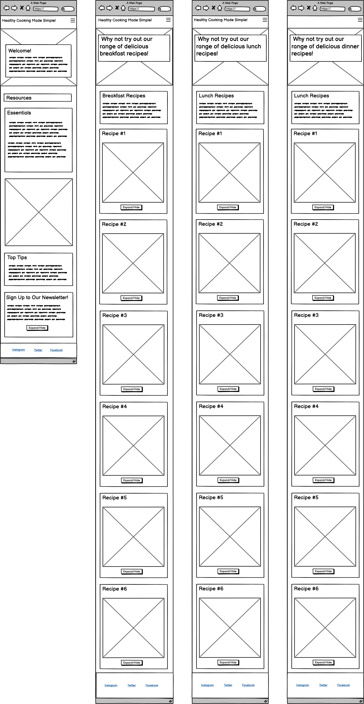
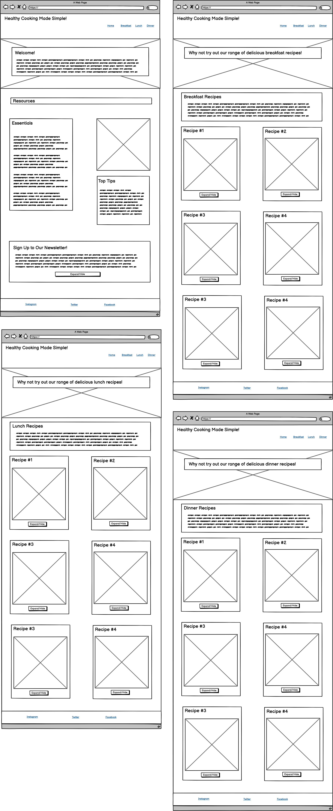
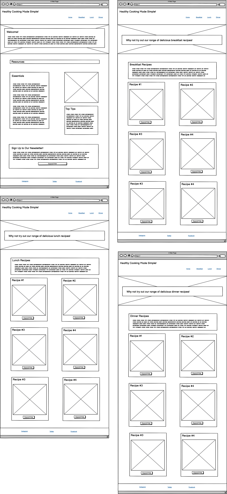
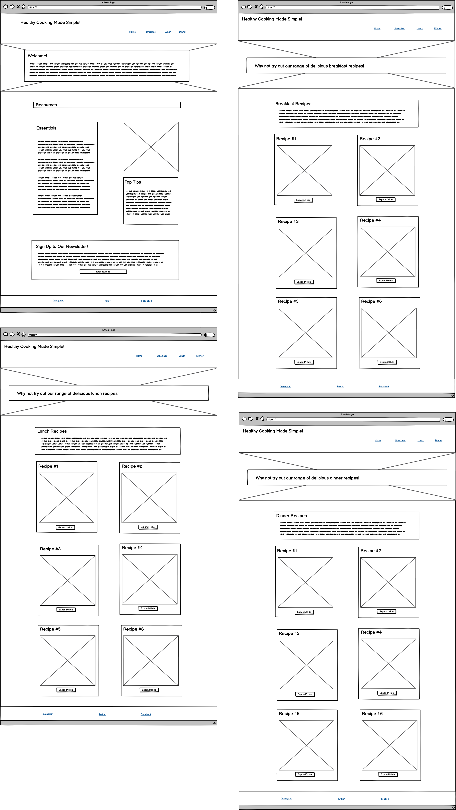

# Healthy Cooking Made Simple!
## Contents

* [User Experience](#user-experience)

* [Design](#design)
  * [Typography](#typography)
  * [Colour Scheme](#colour-scheme)
  * [Images](#images)
  * [Features](#features)
    * [Breakfast Recipes](#breakfast-recipes)
    * [Lunch Recipes](#lunch-recipes)
    * [Dinner Recipes](#dinner-recipes)
  * [Accessibility](#accessability)

* [Languages](#languages)

* [Deployment](#deployment)

* [Testing](#testing)
  * [Bugs](#bugs)
  * [Resolutions](#resolutions)

* [Credits](#credits)
    * [Code](#code)
    * [Content](#content)
    * [Acknowledgemts](#acknowledgements)

- - -

## User Experience
* In this project I've created a recipe website, this purpose is for users to be able to make healthy meals cooked from the comfort of their home without having to decipher difficult recipes. 
* I've created four pages, on the home page the user will find a summary of what the website is for with a few tips and an optional newsletter they can sign up to so they can remain up to date on the latest recipes.

- - -

## Design
## Typography
I carefully chose two fonts for this project as I didn't want to use too many and make the project look cluttered, I imported these to my CSS file from Google Fonts.
* For the title, headings and expand/hide buttons for the recipe instructions and newsletter I used the font Kanit, in weight 700.

* For the main body paragraphs and navigation links I used Montserrat, in its standard weight of 400.

## Colour Scheme
Like with the fonts I didn't want to have too many colours in my project as I thought this could be quite distracting with the amount of images I've got displayed on the web page. I chose to use 5 different colours for separate sections of the page.
* For the header and footer I decided to use #B1CC74 to stand out against the other colours selected and be one of the first things the user sees.
* When it came to the background colour for the body element I wanted to use a colour to compliment the footer but not be too similar and I settled on #E8FCC2 which came out as a lighter green but not too similar to that of the header and footer section.
* As for the background colours for the paragraph sections in the page I chose to use a darker colour of #829399 to make it really stand out again the white font colour I chose, and further complimented this by added another even darker colour of #545F66 for the background of their respective headings. 
* I opted to have a white font colour as I found this provided a great contrast to the header, footer and paragraph section background colours.
* The final colour I selected was always going to be a light blue which I only used to provide a border to the bottom of the header, and paragraph sections and the top of the footer for for this I chose #D0F4EA. 

### Wideframes
#### Mobile Devices (Screensize less than 768px)

#### Tablets (Screensize greater than 768px)

#### Laptops (Screensize greater than 992px)

#### Desktops (Screensize greater than 1200px)

### Images
### Features
### Home
### Breakfast Recipes
### Lunch Recipes
### Dinner Recipes
### Accessibility

- - -