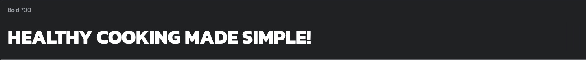
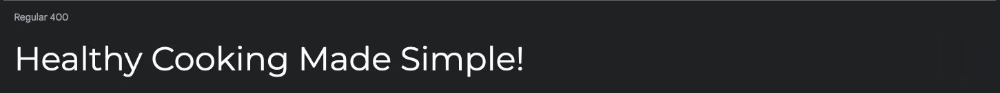
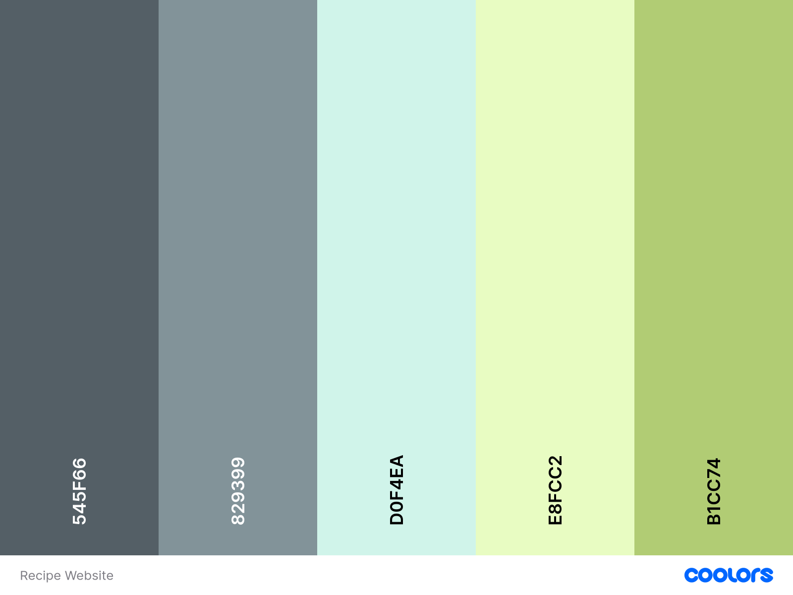

# Healthy Cooking Made Simple!
## Contents

* [User Experience](#user-experience)

* [Design](#design)
  * [Typography](#typography)
  * [Colour Scheme](#colour-scheme)
  * [Wideframes](#wideframes)
  * [Images](#images)
  * [Features](#features)
    * [Breakfast Recipes](#breakfast-recipes)
    * [Lunch Recipes](#lunch-recipes)
    * [Dinner Recipes](#dinner-recipes)
  * [Accessibility](#accessability)

* [Technologies Used](#technologies-used)
  * [Languages](#languages)
  * [Frameworks and Libraries](#frameworks-and-libraries)

* [Deployment and Local Environment](#deployment-and-local-environment)
  * [Deployment](#deployment)
  * [Local Environment](#local-environment)

* [Testing](#testing)
  * [Bugs](#bugs)
  * [Resolutions](#resolutions)
  * [Known Bugs](#known-bugs)
  * [Home Page](#home-page)
  * [Breakfast Recipes Page](#breakfast-recipes-page)
  * [Lunch Recipes Page](#lunch-recipes-page)
  * [Dinner Recipes Page](#dinner-recipes-page)

* [Credits](#credits)
    * [Code](#code)
    * [Content](#content)
    * [Media](#media)
    * [Acknowledgemts](#acknowledgements)

- - -

## User Experience

* In this project I've created a recipe website, this purpose is for users to be able to make healthy meals cooked from the comfort of their home without having to decipher difficult recipes.
* I've created four pages, on the home page the user will find a summary of what the website is for with a few tips and an optional newsletter they can sign up to so they can remain up to date on the latest recipes.

- - -

## Design

## Typography

I carefully chose two fonts for this project as I didn't want to use too many and make the project look cluttered, I imported these to my CSS file from Google Fonts.

* For the title, headings and expand/hide buttons for the recipe instructions and newsletter I used the font Kanit, in weight 700.

* For the main body paragraphs and navigation links I used Montserrat, in its standard weight of 400.

## Colour Scheme

Like with the fonts I didn't want to have too many colours in my project as I thought this could be quite distracting with the amount of images I've got displayed on the web page. I chose to use 5 different colours for separate sections of the page.

* For the header and footer I decided to use #B1CC74 to stand out against the other colours selected and be one of the first things the user sees.
* When it came to the background colour for the body element I wanted to use a colour to compliment the footer but not be too similar and I settled on #E8FCC2 which came out as a lighter green but not too similar to that of the header and footer section.
* As for the background colours for the paragraph sections in the page I chose to use a darker colour of #829399 to make it really stand out again the white font colour I chose, and further complimented this by added another even darker colour of #545F66 for the background of their respective headings.
* I opted to have a white font colour as I found this provided a great contrast to the header, footer and paragraph section background colours.
* The final colour I selected was always going to be a light blue which I only used to provide a border to the bottom of the header, and paragraph sections and the top of the footer for for this I chose #D0F4EA.

## Wideframes

* To give myself an idea of how I'd like the website to look I produced wideframes through the use of [Balsamiq](https://www.balsamiq.com), this allowed me to visualise what I wanted the website to look like before it was created and prompted me to style it accordingly.

* [Mobile Webpages](https://github.com/n-ste/Healthy_Cooking_Made-Simple/blob/main/docs/wideframes/mobile-wideframes.png)
* [Tablet Webpages](https://github.com/n-ste/Healthy_Cooking_Made-Simple/blob/main/docs/wideframes/tablet-wideframes.png)
* [Laptop Webpages](https://github.com/n-ste/Healthy_Cooking_Made-Simple/blob/main/docs/wideframes/laptop-wideframes.png)
* [Desktop Webpages](https://github.com/n-ste/Healthy_Cooking_Made-Simple/blob/main/docs/wideframes/desktop-wideframes.png)

### Images

* All images on my website including hero images and recipe images have been taken from [BBC Food](https://www.bbc.co.uk/food), individual images will be referenced in the credits section.

### Features

### Home

### Breakfast Recipes

### Lunch Recipes

### Dinner Recipes

## Accessibility

## Technologies Used

### Languages

### Frameworks and Libraries

## Deployment and Local Enviroment

### Deployment

### Local Environment

## Testing

### Bugs

### Resolutions

### Known Bugs

### Home Page

### Breakfast Recipes Page

### Lunch Recipes Page

### Dinner Recipes Page

## Credits

### Code

### Media

### Acknowledgements

- - -